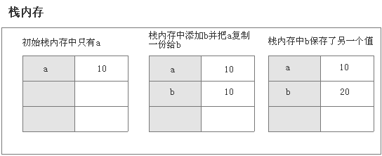

1.JS中let和const有什么用？
	在现代js中，let和const是创建变量的不同方式。在早期js中，使用var关键字来创建变量，
	let和const关键字在ES6版本中引用，其目的是在js中创建两种不同类型的变量，一种不可变，一种可变。
	const：创建不可变得变量，不可变的变量指值在程序的整个生命周期中永不可变的变量。
	let：创建一个可变的变量，类似于var的普通变量，可以任意次数的修改。
2：JS中主要有哪几类错误？
js有三类错误？：
	加载错误：加载Web页面时出现的错误(如语法错误)称加载时错误，他会动态生成错误。
	运行错误：由于滥用HTML语言中的命令而导致的错误。
	逻辑错误：由于对具体不同操作的函数执行错误的逻辑而导致的。
3：如何通过类别名获取dom元素？
	js中使用document.getElementsByClassName()方法来获取具有相同类名的元素
4：js中作用域链是什么及其作用？
	作用域链：一般情况下，变量取值到创建这个变量的函数的作用域中取值。如果在当前作用域中没有取到值，就会向上一级作用域去查，
	直到查到全局作用域，这么一个查询过程形成的链条就叫作用域链。
作用：js中作用域链主要用于解析变量的值，如果没有这个，在不同作用域中定义很多变量，js很难为变量选择某个值。
5：解释JS中的MUL函数
	MUL表示数的简单乘法。在这种技术中，将一个值作为参数传递给一个函数，而该函数将返回另外一个函数，将第二个值作为参数传递给该函数
	然后重复继续，例如：x*y*z可以表示为
	function mul(x){
		return function(y){
			return function(z){
				return x*y*z
			}
		}
	}
6：用纯JS来反转字符串？
攻略1：将字符串转换成数组，利用数组的reverse()函数，最后将数组通过join函数串联起来
	let str="JQuery";
	let strs=str.split("");
	strs=strs.reverse();
	str=strs.join("");
攻略2：将字符数转换成数组，将原始数组进行递减循环，该循环从数组最后一个字符打印，打印每个字符，直到count变为0
	let str="JQuery";
	let strs=str.split("");
	let st="";
	for(let i=strs.length-1;i>=0;i--){
		st=strs[i]+""
	}
7:JS中如何将页面重定向另外一个页面？
1：使用location.href
   window.location.href="www.baidu.com";
2:使用location.replace
   window.location.replace=("www.baidu.com");
8:列出js中的一些设计模式？
	设计模式是设计软件中常见问题的通用可重用解决方案，以下是一些设计模式：
	创建模式：该模式抽象了对象实例化过程。
	结构型模式：这些模式处理不同类和对象以提供新功能。
	行为模式：也称发布-订阅模式，定义一个被观察着和多个观察者的。一对多的对象关系。
	并行实际模式：这些模式处理多线程编程范例。
	架构设计模式：这些模式用于处理架构设计。
9：js中Array.splice()和Array.slice()有什么区别？
	var arr=[0,1,2,3,4,5,6,7,8,9];//设置一个数组
	console.log(arr.slice(2,7));//2,3,4,5,6
	console.log(arr.splice(2,7));//2,3,4,5,6,7,8
	//由此我们简单推测数量两个函数参数的意义,
	slice(start,end),start表示开始位置，第二个参数表示截止到的位置(不包含该位置)
	splice(start,length)第一个参数开始位置,第二个参数截取长度
	slice不会对原数组产生变化
	splice会对直接剔除原数组的截取数据
	10：如何在JS中动态添加/删除对象属性？
	object.property_name=value  新增
	delete object.property_name 删除
11：解释一下什么是promise？
	promise是JS中的一个对象，用于生成可能在将来产生结果的值。值可以是已解析的值，也可以是说明为什么未解析该值得原因。
	promise有三种状态
	   pending:初始状态，既不是成功也不是失败
	   fulfilled:意味着操作完全成功
	   rejected：意味着操作完全失败
	一个等待状态的promise对象能够成功后返回一个值，也能失败后带回一个错误 当这两种情况发生的时候，
	处理函数会排队执行通过then方法会被调用
12：数组中去重复的方法有哪些？
1：使用set
	function uniqueArray(arr){
		let unique_array=Array.from(set(arr));
		 retun uniqur_array;
	}
2:使用filter方法
	function uniqueArray(arr){
		let unique_array=arr.filter(function(elem,index,self){
			return index=self.indexOf(elem)
		});
		 retun uniqur_array;
	}
3:使用for循环函数
	let dups_names = ['Ron', 'Pal', 'Fred', 'Rongo', 'Ron'];
	function dups_arr(dups_names){
		let unique={};
		dups_names.forEach(function(i){
			if(!unique(i)){
				unique[i]=true;
			}
		})
		return Object.keys(unique);
	}
13:undefined、null和undeclared有什么区别？
	1：null表示“没有对象”，既该处不应该有值，转换成数值是为0，典型用方法是：
	   (1)作为函数的参数，表示该函数的参数不是对象。
	   (2)作为对象原型链的终点。
	2：undefined表示“缺少值”，就是此处应该有一个值，但是还没有定义，转换数值时为NaN,典型用法是：
	   (1)变量被声明了，但没有赋值时，就等于undefined。
	   (2)调用函数时，应该提供的参数没有提供，该函数等于undefinded。
	   (3)对象没有赋值的属性，该属性的值为undefined。
	   (4)函数没有返回值时，默认返回undefined。
	3：undeclared:js语法错误，没有声明直接用，js无法找到对应的上下文。
14：列出JS基本和非基本数据之间的一些区别？
	基本数据类型：Undefined、Null、Boolean、Number、String、Symbol(ES6)
	引用数据类型：Object(除了基本数据类型以外的都是对象，数组、函数、正则表达式都是对象)
	区别：(1)基本数据类型是不可变的，而非基本数据是可变的。
		 (2)基本数据类型是指存放在栈中的简单数据段，数据大小可以确定，内存空间大小可以分配，
		 它们是直接按值存放，所以可以按值访问
		 ```javascript
		 var a=10;
		 var b=a;
		 b=20;
		 console.log(a);//10
		 console.log(b);//20
		 ```
		 </img>
		 (3)引用数据类型是指存放在堆内存中的对象，每个空间大小不一样
			变量其实是保存在栈内存的一个指针(既堆内存的引用地址)，这个指针指向堆内存。
			```javascript
				var obj1=new Ojbect();
				var obj1=obj2;
				obj2.name="my name is Tomy";
				console.log(obj1.obj1);//my name is Tomy
			```
		浅拷贝
		    赋值时，如果值是数组或者对象时，我们传递的只是一个地址，如果子对象访问属性室，会根据地址追溯到父对象指向的
			堆内。
			```javascript
			var a={key1:"11111"};
			function copy1(p){
				let c={};
				for(let i in p){
					c{i}=p{i};
				}
				return c;
			}
			a.key2=["test","test"];
			var b=copy(a);
			b.key3="3333"
			console.log(b.key1)//11111
			console.log(a.key2)//["test","test"]
			console.log(a.key3)//undefined
			```
			```javascript
			//ES6实现浅拷贝
			//1.assign
			var a={name:"吹风机"};
			var b=Object.assign({},a);
			b.age=19;
			console.log(a.age)//undefined
			//2数组
			var a=[1,2,3,4];
			var b=a.slice();
			b.push(5);
			console.log(a)//1,2,3,4
			console.log(b)//1,2,3,4,5
			//3
			var a=[1,2,3,4];
			var b=a.contact();
			b.push(5);
			console.log(a)//1,2,3,4
			console.log(b)//1,2,3,4,5
			//4
			var a=[1,2,3,4];
			var b=[...a];
			b.push(5);
			console.log(a)//1,2,3,4
			console.log(b)//1,2,3,4,5
			```
		深拷贝
			不希望父子对象之间产生关联，属性值是对象或者数组只会传址，用递归方式将父对象所有属性类型都遍历
			给子对象。
		    ```javascript
				var a={key1:"11111"}
				function copyDeep(p,c){
					var c=c||{};
					for(let i in p){
						if(typeof p[i]==="object"){
							c[i]=(p[i].constructor===Array)?[]:{};
							copyDeep(p[i],c[i]);
						}else{
							c[i]=p[i];
						}
					}
					return c;
				}
				a.key2 = ["小辉","小辉"]
				var b = {}
				b = Copy(a,b); 
				b.key2.push("大辉");
				b.key2//小辉，小辉，大辉
				a.key2//小辉，小辉  
			```
15：如何在现有的函数中添加新属性
	person.country="china";
16:JS中浅拷贝和深拷贝的区别？
	(1)深拷贝递归地复制新对象中的所有值或属性，而浅拷贝只复制引用。
	(2)在深拷贝中，新对象中的更改不会改变原始对象，而在浅拷贝中新对象更改，原始对象也会更改。
	(3)在深拷贝中，原始对象不和新对象共享相同的属性，而浅拷贝中，它们具有相同属性。
17：如何在JavaScript中每X秒调用一次函数？
	setInterval(function(){
		console.log("被调用啦");
	},3000);
18:解释一下JS的展开操作符？
	展开操作运算符在需要多个参数/变量/元素的位置展示表达式，用三个点(...)
	 ```javascript
	 var mid=[3,4];
	 var b=[1,2,...mid,5,6];
	 console.log(b)//1,2,3,4,5,6